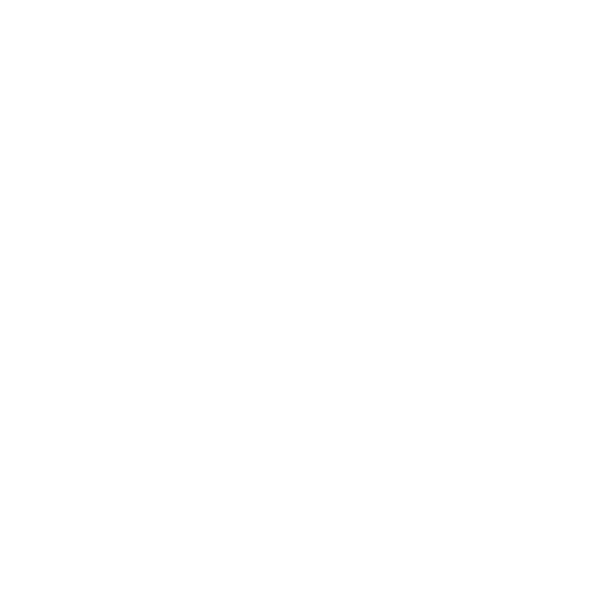

# tosage

[🇯🇵 日本語版](./README_JA.md)

<p align="center">
  
</p>

A Go application that tracks token usage from Claude Code, Cursor, AWS Bedrock, and Google Vertex AI, and sends metrics to Prometheus. It can run in CLI mode (outputs today's token count) or daemon mode (system tray application with periodic metrics sending).

## Features

- **Multi-Provider Token Tracking**: Monitors token usage from Claude Code, Cursor, AWS Bedrock, and Google Vertex AI
- **Prometheus Integration**: Sends metrics via remote write API
- **Dual Mode Operation**: CLI mode for quick checks, daemon mode for continuous monitoring
- **macOS System Tray**: Native system tray support for daemon mode (Claude Code/Cursor only)
- **Automatic Data Discovery**: Finds Claude Code data across multiple locations
- **API Integrations**: 
  - Cursor API for premium request usage and pricing
  - AWS CloudWatch for Bedrock metrics
  - Google Cloud Monitoring for Vertex AI metrics


### Grafana Dashboard

Monitor your token usage with our pre-configured Grafana dashboard:


Import the [Grafana dashboard configuration](./assets/grafana.json) to visualize:
- Token usage per person per hour
- Team-wide token usage trends
- Daily token totals
- Tool breakdown (Claude Code, Cursor, Bedrock, Vertex AI)
- Multi-cloud AI service cost tracking

## Installation

### Quick Installation (Recommended)

The easiest way to install tosage is using our automated installation script:

```bash
# Download and run the installer
curl -fsSL https://raw.githubusercontent.com/ca-srg/tosage/main/scripts/install.sh | bash
```

Or download the script first to review it:

```bash
# Download the script
curl -fsSL https://raw.githubusercontent.com/ca-srg/tosage/main/scripts/install.sh -o install-tosage.sh

# Review the script
less install-tosage.sh

# Run the installer
bash install-tosage.sh
```

The installation script will:
1. Download the latest tosage DMG for your architecture (arm64/x86_64)
2. Install the application to `/Applications/tosage.app`
3. Guide you through configuration setup interactively
4. Create the configuration file at `~/.config/tosage/config.json`

#### Prerequisites

- macOS (the installer is macOS-only)
- `curl` and `jq` (usually pre-installed)
- Internet connection to download from GitHub
- Administrator password (for installing to /Applications)

#### Configuration Values Needed

During installation, you'll be prompted for:
- **Prometheus Remote Write URL** (required): Your Prometheus endpoint (e.g., `https://prometheus.example.com/api/prom/push`)
- **Prometheus Username** (required): Authentication username
- **Prometheus Password** (required): Authentication password
- **Host Label** (optional): Custom label for metrics
- **Metrics Interval** (optional): How often to send metrics in seconds (default: 600)
- **Promtail Configuration** (optional): For log forwarding

### Pre-built Binaries

Download the latest release from [GitHub Releases](https://github.com/ca-srg/tosage/releases).

### From Source

```bash
git clone https://github.com/ca-srg/tosage.git
cd tosage
make build
```

## Configuration

```bash
# 1. Run application to generate config.json

# 2. Modify config.json
$ cat ~/.config/tosage/config.json
{
  "prometheus": {
    "remote_write_url": "https://<prometheus_url>/api/prom/push",
    "username": "",
    "password": ""
  },
  "logging": {
    "promtail": {
      "url": "https://<logs_url>",
      "username": "",
      "password": ""
    }
  },
  "bedrock": {
    "enabled": false,
    "regions": ["us-east-1", "us-west-2"],
    "aws_profile": "",
    "assume_role_arn": "",
    "collection_interval_sec": 900
  },
  "vertex_ai": {
    "enabled": false,
    "project_id": "",
    "locations": ["us-central1", "us-east1", "asia-northeast1"],
    "service_account_key_path": "",
    "collection_interval_sec": 900
  }
}

# 3. Run again
```

### AWS Bedrock Configuration

To enable Bedrock metrics:
1. Set `bedrock.enabled` to `true`
2. Configure AWS credentials using one of:
   - `aws_profile`: AWS profile name from ~/.aws/credentials
   - `assume_role_arn`: IAM role ARN to assume
   - Default AWS credential chain (environment variables, IAM role, etc.)
3. Specify regions to monitor in `bedrock.regions`

### Google Vertex AI Configuration

To enable Vertex AI metrics:
1. Set `vertex_ai.enabled` to `true`
2. Set `vertex_ai.project_id` to your GCP project ID
3. Configure GCP credentials using one of:
   - `service_account_key_path`: Path to service account JSON key file
   - Environment variable `GOOGLE_APPLICATION_CREDENTIALS`
   - Default GCP credential chain (gcloud auth, metadata service, etc.)
4. Specify locations to monitor in `vertex_ai.locations`

## Usage

### CLI Mode

Outputs today's token count:

```bash
# Claude Code and Cursor tokens (default)
tosage

# AWS Bedrock metrics only
tosage --bedrock

# Google Vertex AI metrics only
tosage --vertex-ai
```

**Note**: When using `--bedrock` or `--vertex-ai` flags, Claude Code and Cursor metrics are skipped.

### Daemon Mode

Runs as a system tray application with periodic metrics sending (Claude Code/Cursor only):

```bash
tosage -d
```

**Note**: Daemon mode is not supported when using `--bedrock` or `--vertex-ai` flags.

## Building

### Requirements

#### Build Requirements

- Go 1.21 or higher
- macOS (for daemon mode)
- Make

#### Runtime Requirements

- Prometheus Remote Write API endpoint for metrics collection
- Grafana Loki (optional) for log aggregation via Promtail

### Build Commands

```bash
# Build for current platform
make build

# Build macOS ARM64 binary
make build-darwin

# Build app bundle for macOS
make app-bundle-arm64

# Build DMG installer
make dmg-arm64

# Run all checks (fmt, vet, lint, test)
make check
```

### macOS App Bundle and DMG Creation

#### App Bundle Targets

##### `app-bundle-arm64`
**Purpose**: Creates a macOS app bundle (.app)

1. **Binary Build**: Executes `build-darwin` to create Go binary
2. **Dependency Check**: Runs `dmg-check` to verify required tools
3. **App Bundle Creation**: Executes `create-app-bundle.sh` to create:
   - `tosage.app/Contents/MacOS/tosage` - Executable file
   - `tosage.app/Contents/Info.plist` - App metadata
   - `tosage.app/Contents/Resources/app.icns` - App icon
   - `tosage.app/Contents/PkgInfo` - App type information

#### DMG Targets

##### `dmg-arm64`
**Purpose**: Creates unsigned DMG installers

1. Creates app bundle (executes `app-bundle-*`)
2. Runs `create-dmg.sh` to create DMG:
   - Includes app bundle in DMG
   - Adds symlink to `/Applications`
   - Sets background image and window layout
   - Output: `tosage-{version}-darwin-{arch}.dmg`

##### `dmg-signed-arm64`
**Purpose**: Creates signed DMGs

- Requires `CODESIGN_IDENTITY` environment variable
- Adds code signature to app bundle and DMG

##### `dmg-notarized-arm64`
**Purpose**: Creates signed and notarized DMGs

- Adds Apple notarization in addition to signing
- Allows installation without Gatekeeper warnings

### Build Process Flow

```
Go Source Code
    ↓ (go build)
Executable Binary
    ↓ (create-app-bundle.sh)
.app Bundle
    ↓ (create-dmg.sh)
.dmg Installer
    ↓ (codesign + notarization)
Distributable DMG
```

### Usage Examples

#### Create unsigned DMG:
```bash
make dmg-arm64
```

#### Create signed DMG:
```bash
export CODESIGN_IDENTITY="Developer ID Application: Your Name (TEAMID)"
make dmg-signed-arm64
```

#### Create signed and notarized DMG:
```bash
export CODESIGN_IDENTITY="Developer ID Application: Your Name (TEAMID)"
export API_KEY_ID="your-key-id"
export API_KEY_PATH="/path/to/AuthKey_XXXXX.p8"
export API_ISSUER="your-issuer-id"
make dmg-notarized-arm64
```

#### Create for all architectures:
```bash
make dmg-notarized-all
```

## Architecture

The project follows Clean Architecture with clear separation of concerns:

### Domain Layer
- **Entities**: Core business entities (Claude Code entries, Cursor usage data)
- **Repository Interfaces**: Abstractions for data access
- **Domain Errors**: Business logic specific errors

### Infrastructure Layer
- **Configuration**: Application settings management
- **Dependency Injection**: IoC container for clean dependency management
- **Logging**: Multiple logger implementations (debug, promtail)
- **Repository Implementations**: 
  - Cursor API client for usage data
  - SQLite database for Cursor token history
  - JSONL reader for Claude Code data
  - Prometheus remote write client

### Use Case Layer
- **Services**: Business logic implementation
  - Claude Code data processing
  - Cursor API integration and token tracking
  - AWS Bedrock CloudWatch metrics processing
  - Google Vertex AI monitoring metrics processing
  - Metrics collection and sending
  - Application status tracking

### Interface Layer
- **Controllers**: Application entry points
  - CLI controller for command-line interface
  - Daemon controller for background service
  - System tray controller for UI

## Data Sources

### Claude Code
Searches for data in:
- `~/.config/claude/projects/` (new default)
- `~/.claude/projects/` (legacy)
- `~/Library/Application Support/claude/projects/` (macOS)

### Cursor
Uses Cursor API to fetch:
- Premium (GPT-4) request usage
- Usage-based pricing information
- Team membership status

### AWS Bedrock
Uses CloudWatch API to fetch:
- Input/output token counts per model
- Daily aggregated usage
- Multi-region support

### Google Vertex AI
Uses Cloud Monitoring API to fetch:
- Token usage by model and location
- Daily aggregated metrics
- Multi-location support


## Notes

- macOS only (uses CGO for system tray)
- Time calculations use JST (Asia/Tokyo) timezone
- Configuration file: `~/.config/tosage/config.json`

## Troubleshooting

### Installation Issues

#### "GitHub API rate limit exceeded"
- Wait for the rate limit to reset (usually 1 hour)
- Or download the DMG manually from [GitHub Releases](https://github.com/ca-srg/tosage/releases)

#### "Failed to mount DMG"
- Ensure you have sufficient disk space
- Check if another DMG is already mounted
- Try manually mounting the DMG from Finder

#### "Permission denied" during installation
- The installer requires administrator privileges to copy to /Applications
- Enter your password when prompted by `sudo`

#### "No DMG found for architecture"
- Check that your macOS version is supported
- For Apple Silicon Macs, ensure you're using arm64 builds
- For Intel Macs, x86_64 builds may not be available yet

### Configuration Issues

#### "Invalid URL format"
- Ensure your Prometheus URL includes the protocol (http:// or https://)
- Example: `https://prometheus.example.com/api/prom/push`

#### "Configuration file permission denied"
- The config file is created with secure permissions (600)
- Use `sudo` if you need to manually edit it

### Runtime Issues

#### "tosage.app is damaged and can't be opened"
- This is a macOS Gatekeeper issue
- The installer automatically removes quarantine attributes
- If the issue persists, run: `sudo xattr -cr /Applications/tosage.app`

#### "Cannot find Claude Code data"
- Ensure Claude Code has been run at least once
- Check that data exists in one of the search directories
- See "Data Sources" section for locations

## TODO

- [x] Add Vertex AI token usage tracking
- [x] Add Amazon Bedrock token usage tracking

## GitHub Actions Setup

For maintainers who want to build signed releases, see [GitHub Secrets Setup Guide](GITHUB_SECRETS_SETUP.md) for required configuration.

## License

MIT License