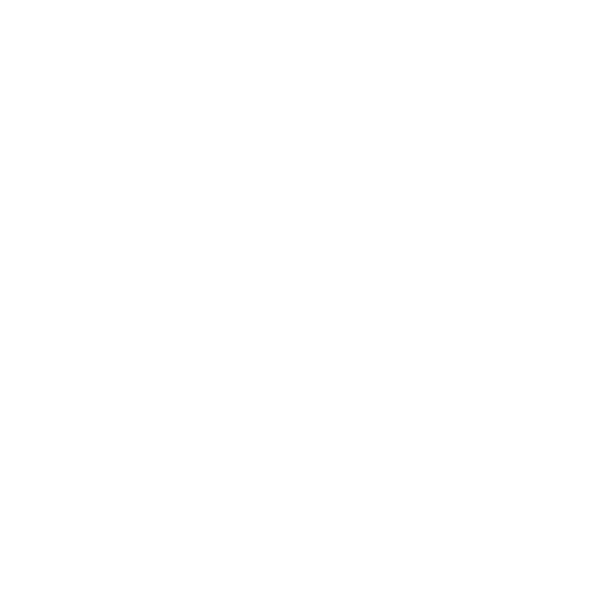
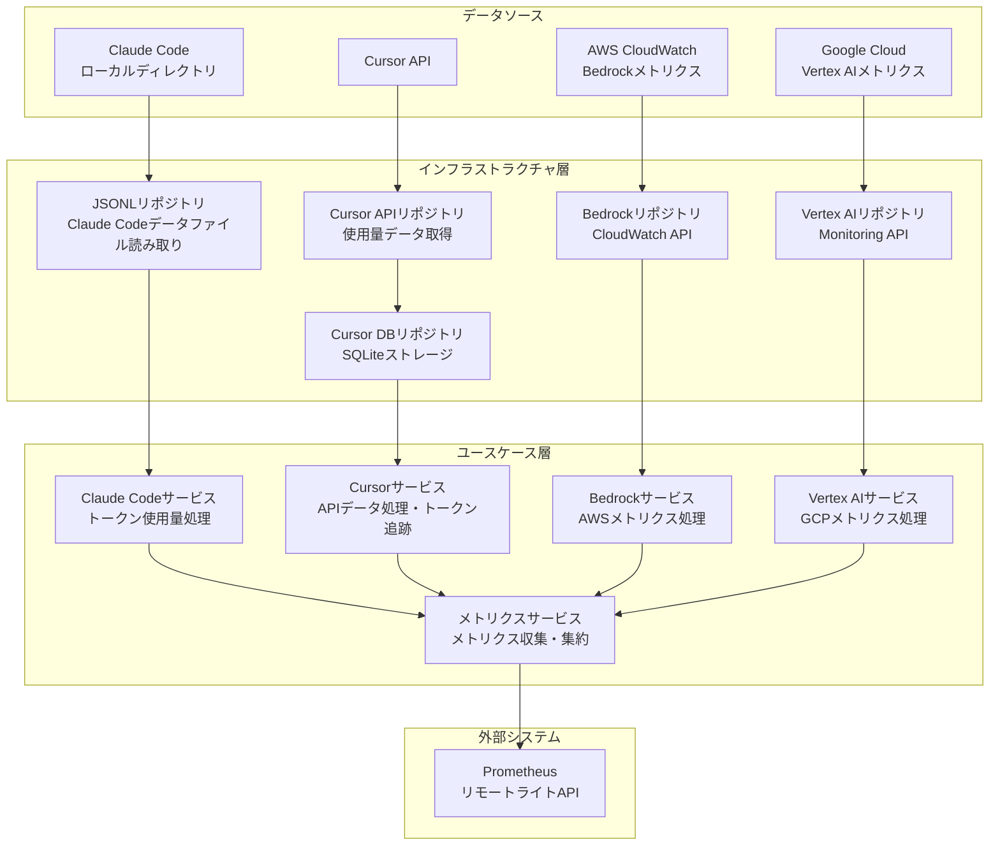
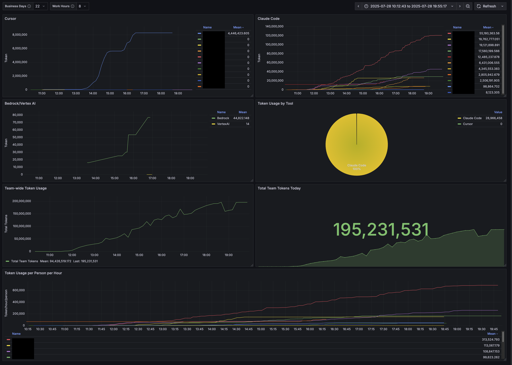

# tosage

<p align="center">
  
</p>

Claude Code、Cursor、AWS Bedrock、Google Vertex AIのトークン使用量を追跡し、Prometheusにメトリクスを送信するGoアプリケーションです。CLIモード（当日のトークン数を出力）またはデーモンモード（定期的にメトリクスを送信するシステムトレイアプリケーション）で実行できます。

## 機能

- **マルチプロバイダートークン追跡**: Claude Code、Cursor、AWS Bedrock、Google Vertex AIのトークン使用量を監視
- **Prometheus統合**: リモートライトAPIを介したメトリクス送信
- **デュアルモード動作**: 素早い確認のためのCLIモード、継続的な監視のためのデーモンモード
- **macOSシステムトレイ**: デーモンモード用のネイティブシステムトレイサポート（Claude Code/Cursorのみ）
- **自動データ検出**: 複数の場所からClaude Codeのデータを自動検出
- **API統合**: 
  - プレミアムリクエストの使用状況と料金情報のためのCursor API
  - BedrockメトリクスのためのAWS CloudWatch
  - Vertex AIメトリクスのためのGoogle Cloud Monitoring



### Grafanaダッシュボード

事前設定済みのGrafanaダッシュボードでトークン使用量を監視:



[Grafanaダッシュボード設定](./assets/grafana.json)をインポートして以下を可視化:
- 1時間あたりの個人別トークン使用量
- チーム全体のトークン使用傾向
- 日別トークン合計
- ツール別内訳（Claude Code、Cursor、Bedrock、Vertex AI）
- マルチクラウドAIサービスのコスト追跡

## インストール

### クイックインストール（推奨）

tosageをインストールする最も簡単な方法は、自動インストールスクリプトを使用することです：

```bash
# インストーラーをダウンロードして実行
curl -fsSL https://raw.githubusercontent.com/ca-srg/tosage/main/scripts/install.sh | bash
```

または、最初にスクリプトをダウンロードして確認する場合：

```bash
# スクリプトをダウンロード
curl -fsSL https://raw.githubusercontent.com/ca-srg/tosage/main/scripts/install.sh -o install-tosage.sh

# スクリプトを確認
less install-tosage.sh

# インストーラーを実行
bash install-tosage.sh
```

インストールスクリプトは以下を実行します：
1. お使いのアーキテクチャ（arm64/x86_64）に応じた最新のtosage DMGをダウンロード
2. `/Applications/tosage.app`にアプリケーションをインストール
3. 対話的に設定をガイド
4. `~/.config/tosage/config.json`に設定ファイルを作成

#### 前提条件

- macOS（インストーラーはmacOS専用）
- `curl`と`jq`（通常はプリインストール済み）
- GitHubからダウンロードするためのインターネット接続
- /Applicationsにインストールするための管理者パスワード

#### 必要な設定値

インストール中に以下の項目を入力します：
- **Prometheus リモートライトURL**（必須）：PrometheusエンドポイントURL（例：`https://prometheus.example.com/api/prom/push`）
- **Prometheus ユーザー名**（必須）：認証用ユーザー名
- **Prometheus パスワード**（必須）：認証用パスワード
- **ホストラベル**（任意）：メトリクス用のカスタムラベル
- **メトリクス間隔**（任意）：メトリクス送信間隔（秒）（デフォルト：600）
- **Promtail設定**（任意）：ログ転送用

### ビルド済みバイナリ

[GitHub Releases](https://github.com/ca-srg/tosage/releases)から最新リリースをダウンロードしてください。

### ソースからビルド

```bash
git clone https://github.com/ca-srg/tosage.git
cd tosage
make build
```

## 設定

```bash
# 1. アプリケーションを実行してconfig.jsonを生成

# 2. config.jsonを修正
$ cat ~/.config/tosage/config.json
{
  "prometheus": {
    "remote_write_url": "https://<prometheus_url>/api/prom/push",
    "username": "",
    "password": ""
  },
  "logging": {
    "promtail": {
      "url": "https://<logs_url>",
      "username": "",
      "password": ""
    }
  },
  "bedrock": {
    "enabled": false,
    "regions": ["us-east-1", "us-west-2"],
    "aws_profile": "",
    "assume_role_arn": "",
    "collection_interval_sec": 900
  },
  "vertex_ai": {
    "enabled": false,
    "project_id": "",
    "locations": ["us-central1", "us-east1", "asia-northeast1"],
    "service_account_key_path": "",
    "collection_interval_sec": 900
  }
}

# 3. 再度実行
```

### AWS Bedrock設定

Bedrockメトリクスを有効にするには：
1. `bedrock.enabled`を`true`に設定
2. AWS認証情報を以下のいずれかで設定：
   - `aws_profile`: ~/.aws/credentialsのAWSプロファイル名
   - `assume_role_arn`: 引き受けるIAMロールARN
   - デフォルトのAWS認証チェーン（環境変数、IAMロールなど）
3. 監視するリージョンを`bedrock.regions`に指定

### Google Vertex AI設定

Vertex AIメトリクスを有効にするには：
1. `vertex_ai.enabled`を`true`に設定
2. `vertex_ai.project_id`にGCPプロジェクトIDを設定
3. GCP認証情報を以下のいずれかの方法で設定（優先順位順）：
   - **サービスアカウントキーJSON**（最優先）：
     - 設定: `service_account_key`: JSON内容を文字列として
     - 環境変数: `TOSAGE_VERTEX_AI_SERVICE_ACCOUNT_KEY`
   - **サービスアカウントキーファイル**：
     - 設定: `service_account_key_path`: JSONキーファイルへのパス
     - 環境変数: `TOSAGE_VERTEX_AI_SERVICE_ACCOUNT_KEY_PATH`
   - **アプリケーションデフォルト認証情報**（最低優先）：
     - 環境変数: `GOOGLE_APPLICATION_CREDENTIALS`
     - gcloud auth application-default login
     - GCPメタデータサービス（GCP上で実行時）
4. 監視するロケーションを`vertex_ai.locations`に指定

#### 認証優先順位システム

Vertex AI統合では3段階の認証優先順位システムを使用します：

1. **直接サービスアカウントキー** - `service_account_key`が設定または`TOSAGE_VERTEX_AI_SERVICE_ACCOUNT_KEY`環境変数で提供された場合
2. **サービスアカウントキーファイル** - `service_account_key_path`が提供された場合
3. **アプリケーションデフォルト認証情報** - Googleのデフォルト認証情報検出を使用

これにより柔軟なデプロイシナリオが可能になります：
- ローカル開発: `gcloud auth application-default login`を使用
- CI/CD: サービスアカウントキーを環境変数として設定
- 本番環境: サービスアカウントキーファイルまたはGCPメタデータサービスを使用

## 使用方法

### CLIモード

今日のトークン数を出力:

```bash
# Claude CodeとCursorのトークン（デフォルト）
tosage

# AWS Bedrockメトリクスのみ
tosage --bedrock

# Google Vertex AIメトリクスのみ
tosage --vertex-ai
```

**注意**: `--bedrock`または`--vertex-ai`フラグを使用する場合、Claude CodeとCursorのメトリクスはスキップされます。

### デーモンモード

定期的にメトリクスを送信するシステムトレイアプリケーションとして実行（Claude Code/Cursorのみ）:

```bash
tosage -d
```

**注意**: デーモンモードは`--bedrock`または`--vertex-ai`フラグを使用している場合はサポートされません。

## コンテナの使用方法

tosageは、GitHub Container Registry (ghcr.io)でマルチアーキテクチャコンテナイメージとして利用可能です。コンテナは`linux/amd64`と`linux/arm64`の両方のアーキテクチャをサポートしています。

### イメージの取得

```bash
# 最新版
docker pull ghcr.io/ca-srg/tosage:latest

# 特定のバージョン
docker pull ghcr.io/ca-srg/tosage:v1.0.0

# 特定のアーキテクチャ用
docker pull --platform linux/arm64 ghcr.io/ca-srg/tosage:latest
```

### コンテナの実行

コンテナはデフォルトでCLIモードで実行されます：

```bash
# デフォルト設定で実行
docker run --rm ghcr.io/ca-srg/tosage:latest

# カスタム設定ファイルで実行
docker run --rm \
  -v ~/.config/tosage/config.json:/home/nonroot/.config/tosage/config.json:ro \
  ghcr.io/ca-srg/tosage:latest

# 環境変数で実行
docker run --rm \
  -e TOSAGE_PROMETHEUS_URL="https://prometheus.example.com/api/prom/push" \
  -e TOSAGE_PROMETHEUS_USERNAME="user" \
  -e TOSAGE_PROMETHEUS_PASSWORD="pass" \
  ghcr.io/ca-srg/tosage:latest

# Bedrockメトリクスをチェック
docker run --rm \
  -e AWS_REGION="us-east-1" \
  ghcr.io/ca-srg/tosage:latest --bedrock

# アプリケーションデフォルト認証情報でVertex AIメトリクスをチェック
docker run --rm \
  -e GOOGLE_CLOUD_PROJECT="my-project" \
  -v ~/.config/gcloud:/home/nonroot/.config/gcloud:ro \
  ghcr.io/ca-srg/tosage:latest --vertex-ai

# サービスアカウントキーファイルでVertex AIメトリクスをチェック
docker run --rm \
  -e TOSAGE_VERTEX_AI_ENABLED="true" \
  -e TOSAGE_VERTEX_AI_PROJECT_ID="my-project" \
  -v /path/to/service-account-key.json:/key.json:ro \
  -e TOSAGE_VERTEX_AI_SERVICE_ACCOUNT_KEY_PATH="/key.json" \
  ghcr.io/ca-srg/tosage:latest --vertex-ai

# 環境変数としてサービスアカウントキーでVertex AIメトリクスをチェック
docker run --rm \
  -e TOSAGE_VERTEX_AI_ENABLED="true" \
  -e TOSAGE_VERTEX_AI_PROJECT_ID="my-project" \
  -e TOSAGE_VERTEX_AI_SERVICE_ACCOUNT_KEY='{"type":"service_account",...}' \
  ghcr.io/ca-srg/tosage:latest --vertex-ai
```

### Docker Composeの例

```yaml
version: '3.8'

services:
  tosage:
    image: ghcr.io/ca-srg/tosage:latest
    restart: unless-stopped
    volumes:
      - ~/.config/tosage/config.json:/home/nonroot/.config/tosage/config.json:ro
    environment:
      - TOSAGE_PROMETHEUS_URL=${PROMETHEUS_URL}
      - TOSAGE_PROMETHEUS_USERNAME=${PROMETHEUS_USERNAME}
      - TOSAGE_PROMETHEUS_PASSWORD=${PROMETHEUS_PASSWORD}
    command: ["--mode", "cli"]
```

### Kubernetesの例

```yaml
apiVersion: batch/v1
kind: CronJob
metadata:
  name: tosage-metrics
spec:
  schedule: "0 */6 * * *"  # 6時間ごと
  jobTemplate:
    spec:
      template:
        spec:
          containers:
          - name: tosage
            image: ghcr.io/ca-srg/tosage:latest
            env:
            - name: TOSAGE_PROMETHEUS_URL
              valueFrom:
                secretKeyRef:
                  name: tosage-config
                  key: prometheus-url
            - name: TOSAGE_PROMETHEUS_USERNAME
              valueFrom:
                secretKeyRef:
                  name: tosage-config
                  key: prometheus-username
            - name: TOSAGE_PROMETHEUS_PASSWORD
              valueFrom:
                secretKeyRef:
                  name: tosage-config
                  key: prometheus-password
          restartPolicy: OnFailure
```

### コンテナイメージの詳細

- **ベースイメージ**: `gcr.io/distroless/static:nonroot` - セキュリティのための最小限のdistrolessイメージ
- **ユーザー**: 非rootユーザーとして実行 (65532:65532)
- **アーキテクチャ**: `linux/amd64`, `linux/arm64`
- **エントリーポイント**: `/tosage`
- **デフォルトコマンド**: `["--mode", "cli"]`

### 利用可能なタグ

- `latest` - 最新の安定版リリース
- `vX.Y.Z` - 特定のバージョン（例：`v1.0.0`）
- `vX.Y` - マイナーバージョン（例：`v1.0`）
- `vX` - メジャーバージョン（例：`v1`）
- `main-<short-sha>` - mainブランチからの開発ビルド

## ビルド

### 必要要件

#### ビルド要件

- Go 1.21以上
- macOS（デーモンモード用）
- Make

#### 実行時要件

- メトリクス収集用のPrometheus Remote Write APIエンドポイント
- ログ集約用のGrafana Loki（オプション、Promtail経由）

### ビルドコマンド

```bash
# 現在のプラットフォーム用にビルド
make build

# macOS ARM64バイナリをビルド
make build-darwin

# macOS用アプリバンドルをビルド
make app-bundle-arm64

# DMGインストーラーをビルド
make dmg-arm64

# すべてのチェックを実行（fmt、vet、lint、test）
make check
```

### macOSアプリバンドルとDMG作成

#### アプリバンドルターゲット

##### `app-bundle-arm64`
**目的**: macOSアプリバンドル（.app）を作成

1. **バイナリビルド**: `build-darwin`を実行してGoバイナリを作成
2. **依存関係チェック**: `dmg-check`を実行して必要なツールを確認
3. **アプリバンドル作成**: `create-app-bundle.sh`を実行して以下を作成:
   - `tosage.app/Contents/MacOS/tosage` - 実行ファイル
   - `tosage.app/Contents/Info.plist` - アプリメタデータ
   - `tosage.app/Contents/Resources/app.icns` - アプリアイコン
   - `tosage.app/Contents/PkgInfo` - アプリタイプ情報

#### DMGターゲット

##### `dmg-arm64`
**目的**: 未署名のDMGインストーラーを作成

1. アプリバンドルを作成（`app-bundle-*`を実行）
2. `create-dmg.sh`を実行してDMGを作成:
   - DMGにアプリバンドルを含める
   - `/Applications`へのシンボリックリンクを追加
   - 背景画像とウィンドウレイアウトを設定
   - 出力: `tosage-{version}-darwin-{arch}.dmg`

##### `dmg-signed-arm64`
**目的**: 署名済みDMGを作成

- `CODESIGN_IDENTITY`環境変数が必要
- アプリバンドルとDMGにコード署名を追加

##### `dmg-notarized-arm64`
**目的**: 署名・公証済みDMGを作成

- 署名に加えてApple公証を追加
- Gatekeeperの警告なしでインストール可能

### ビルドプロセスフロー

```
Goソースコード
    ↓ (go build)
実行可能バイナリ
    ↓ (create-app-bundle.sh)
.appバンドル
    ↓ (create-dmg.sh)
.dmgインストーラー
    ↓ (codesign + 公証)
配布可能なDMG
```

### 使用例

#### 未署名DMGを作成:
```bash
make dmg-arm64
```

#### 署名済みDMGを作成:
```bash
export CODESIGN_IDENTITY="Developer ID Application: Your Name (TEAMID)"
make dmg-signed-arm64
```

#### 署名・公証済みDMGを作成:
```bash
export CODESIGN_IDENTITY="Developer ID Application: Your Name (TEAMID)"
export API_KEY_ID="your-key-id"
export API_KEY_PATH="/path/to/AuthKey_XXXXX.p8"
export API_ISSUER="your-issuer-id"
make dmg-notarized-arm64
```

#### すべてのアーキテクチャ用に作成:
```bash
make dmg-notarized-all
```

## アーキテクチャ

本プロジェクトは関心の分離を明確にしたクリーンアーキテクチャに従っています：

### ドメイン層
- **エンティティ**: コアビジネスエンティティ（Claude Codeエントリ、Cursor使用データ）
- **リポジトリインターフェース**: データアクセスの抽象化
- **ドメインエラー**: ビジネスロジック固有のエラー

### インフラストラクチャ層
- **設定**: アプリケーション設定管理
- **依存性注入**: クリーンな依存関係管理のためのIoCコンテナ
- **ロギング**: 複数のロガー実装（debug、promtail）
- **リポジトリ実装**: 
  - 使用データ用Cursor APIクライアント
  - Cursorトークン履歴用SQLiteデータベース
  - Claude Codeデータ用JSONLリーダー
  - Prometheusリモートライトクライアント

### ユースケース層
- **サービス**: ビジネスロジック実装
  - Claude Codeデータ処理
  - Cursor API統合とトークン追跡
  - AWS Bedrock CloudWatchメトリクス処理
  - Google Vertex AIモニタリングメトリクス処理
  - メトリクス収集と送信
  - アプリケーションステータス追跡

### インターフェース層
- **コントローラ**: アプリケーションエントリーポイント
  - コマンドラインインターフェース用CLIコントローラ
  - バックグラウンドサービス用デーモンコントローラ
  - UI用システムトレイコントローラ

## データソース

### Claude Code
以下の場所でデータを検索:
- `~/.config/claude/projects/`（新しいデフォルト）
- `~/.claude/projects/`（レガシー）
- `~/Library/Application Support/claude/projects/`（macOS）

### Cursor
Cursor APIを使用して以下を取得:
- プレミアム（GPT-4）リクエスト使用量
- 使用量ベースの料金情報
- チームメンバーシップステータス

### AWS Bedrock
CloudWatch APIを使用して以下を取得:
- モデル別の入出力トークン数
- 日次集計使用量
- マルチリージョンサポート

### Google Vertex AI
Cloud Monitoring APIを使用して以下を取得:
- モデルとロケーション別のトークン使用量
- 日次集計メトリクス
- マルチロケーションサポート


## 注意事項

- macOSのみ（システムトレイにCGOを使用）
- 時刻計算はJST（アジア/東京）タイムゾーンを使用
- 設定ファイル: `~/.config/tosage/config.json`

## トラブルシューティング

### インストールの問題

#### "GitHub APIレート制限を超えました"
- レート制限がリセットされるまで待つ（通常1時間）
- または[GitHub Releases](https://github.com/ca-srg/tosage/releases)からDMGを手動でダウンロード

#### "DMGのマウントに失敗しました"
- 十分なディスク容量があることを確認
- 他のDMGがすでにマウントされていないか確認
- FinderからDMGを手動でマウントしてみる

#### インストール中の"アクセスが拒否されました"
- インストーラーは/Applicationsにコピーするため管理者権限が必要
- `sudo`でプロンプトが表示されたらパスワードを入力

#### "アーキテクチャ用のDMGが見つかりません"
- お使いのmacOSバージョンがサポートされているか確認
- Apple SiliconのMacの場合、arm64ビルドを使用していることを確認
- Intel Macの場合、x86_64ビルドはまだ利用できない可能性があります

### 設定の問題

#### "無効なURL形式"
- PrometheusのURLにプロトコル（http://またはhttps://）が含まれていることを確認
- 例：`https://prometheus.example.com/api/prom/push`

#### "設定ファイルのアクセスが拒否されました"
- 設定ファイルはセキュアな権限（600）で作成されます
- 手動で編集する必要がある場合は`sudo`を使用

### 実行時の問題

#### "tosage.appは壊れているため開くことができません"
- これはmacOS Gatekeeperの問題です
- インストーラーは自動的に検疫属性を削除します
- 問題が続く場合は次を実行：`sudo xattr -cr /Applications/tosage.app`

#### "Claude Codeのデータが見つかりません"
- Claude Codeが少なくとも一度実行されていることを確認
- データが検索ディレクトリのいずれかに存在することを確認
- 場所については「データソース」セクションを参照

## TODO

- [x] Vertex AIトークン使用量追跡を追加
- [x] Amazon Bedrockトークン使用量追跡を追加

## GitHub Actionsセットアップ

署名済みリリースをビルドしたいメンテナーは、必要な設定について[GitHub Secretsセットアップガイド](GITHUB_SECRETS_SETUP.md)を参照してください。

## ライセンス

MIT License